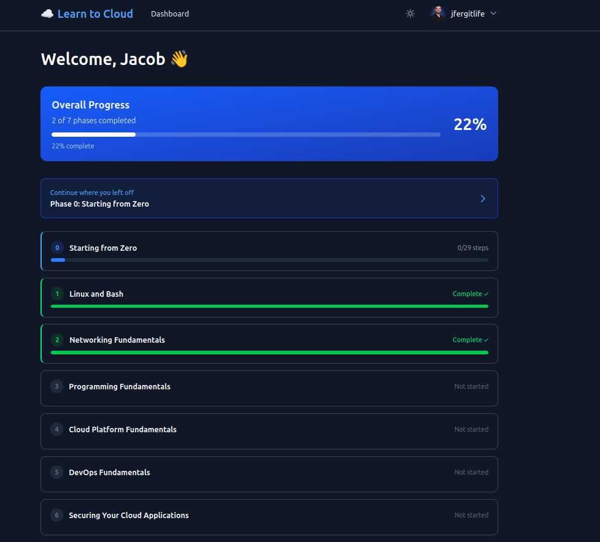
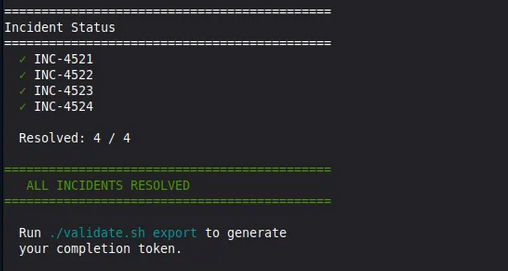

i just finished the second phase of learn2cloud. in this one i was the on-call cloud engineer. four tickets came in after-hours and they were mine to resolve.

i wanted to document the process and the lessons that came out of it.

## the four tickets

four incidents, sorted easiest to hardest:

- **inc-4521:** api service in the private subnet can't reach external apis. timeouts on every outbound call.
- **inc-4522:** internal dns broken. web.internal.local, api.internal.local, db.internal.local won't resolve.
- **inc-4523:** web frontend can't reach the api on 8080. api can't reach the database on 5432.
- **inc-4524:** security audit findings. ssh wide open from the internet, database listening on 0.0.0.0/0, icmp unrestricted.

each one tested a different piece of the aws networking stack. route tables, private hosted zones, security groups in both directions, nacls, and the bastion pattern.

## the ticket that taught me the most

inc-4523 was the most challenging. it looked simple. two services that couldn't talk to each other. it turned into five separate fixes across four different filter layers.

i added an ingress rule on the api security group to let the web tier reach port 8080. tested it. timed out. added an ingress rule on the database security group to let the api reach 5432. tested it. timed out. checked the security groups again. both rules were there. both correct. still timeout.

so i had to look elsewhere.

one layer below the security groups are the nacls. stateless, attached at the subnet level. aws will let you add a custom nacl on a subnet and it will override your assumptions. there was an explicit deny on inbound tcp/5432 evaluated before the allow-all. i deleted the rule and tested again. still a timeout.

this is when the frustration kicked in. i had to step away, take a breather, and reevaluate my approach.

i decided i needed to walk the whole packet path. a single tcp connection from the api server to the database has to clear each layer in order:

1. the api server's host firewall
2. the api security group's egress filter
3. the private subnet's nacl on the way out
4. the database subnet's nacl on the way in
5. the database security group's ingress filter
6. the database service actually listening on 5432

i had fixed layers 4 and 5. layer 2 was the one i missed. the api security group had a tight egress allowlist. port 80 and port 443 to anywhere. nothing else. syn packets to 5432 were being dropped before they ever left the host.

added the egress rule. the connection succeeded.

then i ran the validator. still red. because the same problem existed on the web tier. web security group egress only allowed 80 and 443. i'd authorized inbound 8080 on the api sg, but the web tier couldn't send outbound 8080 to begin with.

five fixes on one ticket. the cloud network is a layer cake with each layer having its own rules, and any one of them can drop packets without telling you.

## the moment i almost went in circles

inc-4522 had a wrinkle the curriculum doesn't warn you about.

i added the missing a records to route 53. confirmed they were there. ran dig api.internal.local from inside the vm. empty answer. tried dig web.internal.local. empty. flushed the resolver cache. still empty.

if i'd trusted that result alone i would have gone hunting for a route 53 problem that didn't exist. instead i queried the vpc resolver directly, bypassing the vm's local stub:

`dig @10.0.0.2 +short api.internal.local`

it returned the correct ip immediately.

so the cloud was fine. the vm was lying. it turned out systemd-resolved on ubuntu treats anything ending in .local as a multicast dns query and refuses to forward it to upstream resolvers. the dig warning had been there the whole time, telling me .local is reserved for multicast dns. i'd glossed over it.

i ran the validator anyway. it passed. because the validator queries via the vpc resolver path, not the vm's local stub. the cloud was correct. the host-level weirdness was a separate problem outside the ticket's scope.

that was a good lesson to keep. don't always trust a single diagnostic tool. ask a different tool the same questions to get additional vantage points.

## the wins

inc-4521 was the cleanest one. nat gateway was healthy. the default route was just attached to the wrong route table. it pointed the database subnet at the internet instead of the private subnet. one aws ec2 create-route command and the api server could reach the world again.

inc-4524 was the satisfying one. the security audit findings. ssh wide open from the internet. database listening on 0.0.0.0/0. icmp unrestricted. eleven minutes of careful revoke-and-authorize sequencing to lock ssh down to a single ip, scope the database to the api security group only, and tighten icmp to the bastion. 

to close it out, i ran the validator and all four checks came back resolved. 

## what i'm taking with me

a few things from this lab that aren't in any course outline.

connection refused and connection timed out are different fingerprints. refused means the packet got there and the host actively rejected it. timeout means the packet vanished. either no route exists, or a firewall silently dropped it. in aws, security groups always silently drop. when troubleshooting, the failure shape is the first clue.

troubleshooting cloud networking is walking the stack. sg egress, nacl egress, nacl ingress, sg ingress, host firewall, service binding. methodical beats clever every time.

the cloud is fine, the os is lying. sometimes. when one layer reports broken, ask a different layer the same question before you start fixing.

## what's next

phase 3 is programming fundamentals. python, scripting, working with apis. five more phases to go.

if you want to follow the rest of the journey, [subscribe](https://buttondown.email/JfergITLife) and i'll send the milestones, the labs, and the lessons that don't make the syllabus.

two of seven. on to the next one.